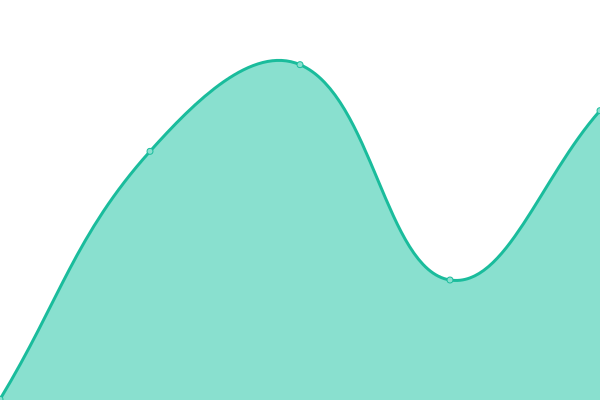

# [📈 Live Status](https://status.atlas.bi): <!--live status--> **🟧 Partial outage**

This repository contains the open-source uptime monitor and status page for [Atlas](https://status.atlas.bi), powered by [Upptime](https://github.com/upptime/upptime).

With [Upptime](https://upptime.js.org), you can get your own unlimited and free uptime monitor and status page, powered entirely by a GitHub repository. We use [Issues](https://github.com/atlas-bi/uptime/issues) as incident reports, [Actions](https://github.com/Riverside-Healthcare/uptime/actions) as uptime monitors, and [Pages](https://status.atlas.bi) for the status page.

<!--start: status pages-->
<!-- This summary is generated by Upptime (https://github.com/upptime/upptime) -->
<!-- Do not edit this manually, your changes will be overwritten -->
<!-- prettier-ignore -->
| URL | Status | History | Response Time | Uptime |
| --- | ------ | ------- | ------------- | ------ |
|  [atlas.bi](https://www.atlas.bi) | 🟩 Up | [atlas-bi.yml](https://github.com/atlas-bi/uptime/commits/HEAD/history/atlas-bi.yml) | 

 200ms
     
 | 

<a href="https://status.atlas.bi/history/atlas-bi">99.83%</a>
    

|  [demo.atlas.bi](https://demo.atlas.bi) | 🟥 Down | [demo-atlas-bi.yml](https://github.com/atlas-bi/uptime/commits/HEAD/history/demo-atlas-bi.yml) | 

 316ms
     
 | 

<a href="https://status.atlas.bi/history/demo-atlas-bi">88.34%</a>
    

|  [atlas-hub.atlas.bi](https://atlas-hub.atlas.bi) | 🟥 Down | [atlas-hub-atlas-bi.yml](https://github.com/atlas-bi/uptime/commits/HEAD/history/atlas-hub-atlas-bi.yml) | 

 12685ms
     
 | 

<a href="https://status.atlas.bi/history/atlas-hub-atlas-bi">0.42%</a>
    

<!--end: status pages-->

[**Visit our status website →**](https://status.atlas.bi)

## 📄 License

- Powered by: [Upptime](https://github.com/upptime/upptime)
- Code: [MIT](./LICENSE) © [Atlas](https://status.atlas.bi)
- Data in the `./history` directory: [Open Database License](https://opendatacommons.org/licenses/odbl/1-0/)
